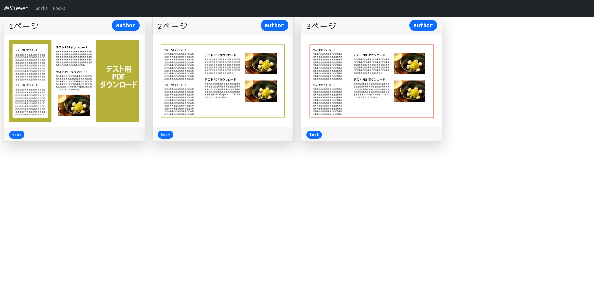
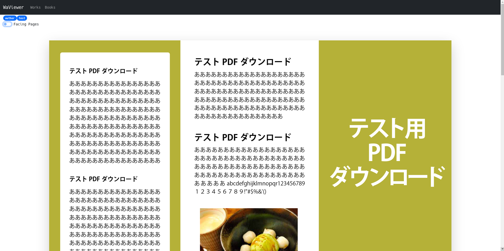
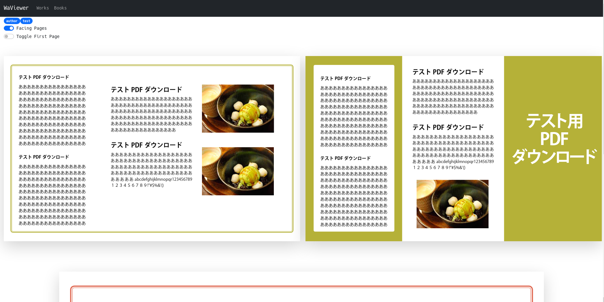
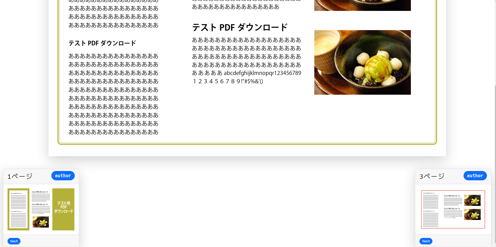

# WaViewer
WaViewer(話ビューアー)は漫画での「話」、本での「セクション」「項目」単位でPDFを閲覧するためのビューアーです。






## 使い方
まずビルドします
```sh
npm ci
npm build
```

ビルドをすると、`dist`というディレクトリができるので、そのディレクトリに`pdf`というディレクトリを作成します。
このディレクトリが閲覧するpdfを配置するためのディレクトリになります。

あとはdistディレクトリをapacheなどの静的配信サーバーで公開することで閲覧が可能です。

## pdfファイルの配置
上述のpdfディレクトリへのpdfファイルの配置には、以下のような手順が必要です。

* 適切な階層にpdfファイルを配置する
* `works.json`に作品の情報を記入する

    
なお２つ目のworks.jsonへの記入は、実際に運用する際には、[works.json生成ツール](https://github.com/Kotaro7750/WaViewer-json-builder)を用いると楽に生成することができます。

### pdfファイルの階層
pdfディレクトリは、直接pdfファイルを置くのではなく、「著者」のディレクトリの下に置きます。
つまり、著者`author`、ファイル名`test.pdf`というpdfファイルは、`pdf/author/test.pdf`という配置になります。

### works.jsonについて
配置されたpdfファイルの情報を表す`works.json`を`pdf/works.json`として配置します。

このjsonファイルは以下のような構造を取ります。

```json
[
  {
    "artist": "author",
    "book_title": "test",
    "title": "1ページ",
    "startPageNumber": 1,
    "id": 0,
    "endPageNumber": 1,
    "prevWorkId": -1,
    "nextWorkId": 1
  },
  {
    "artist": "author",
    "book_title": "test",
    "title": "2ページ",
    "startPageNumber": 2,
    "id": 1,
    "endPageNumber": 2,
    "prevWorkId": 0,
    "nextWorkId": 2
  },
  {
    "artist": "author",
    "book_title": "test",
    "title": "3ページ",
    "startPageNumber": 3,
    "id": 2,
    "endPageNumber": 3,
    "prevWorkId": 1,
    "nextWorkId": -1
  }
]
```

全体的な構造としては、いくつかの属性を持つオブジェクトの配列となっており、それぞれのオブジェクトは「話」や「セクション」を表します。
例えば１つ目の要素は、「著者`author`の`test.pdf`というファイルの1ページ目から1ページ目（つまりは1ページ目だけ）の範囲は、`１ページ`という名前の"話"である」ことを表しています。

また、１つ目の要素の`nextWorkId`は1となっていますが、これはidが1の要素（つまりは２つ目の要素）が次の「話」であることを指しています。
`prevWorkId`は、同様にして前の「話」であることを指します。
これらのidとして-1が指定された場合には前後の「話」がないことを表します。


